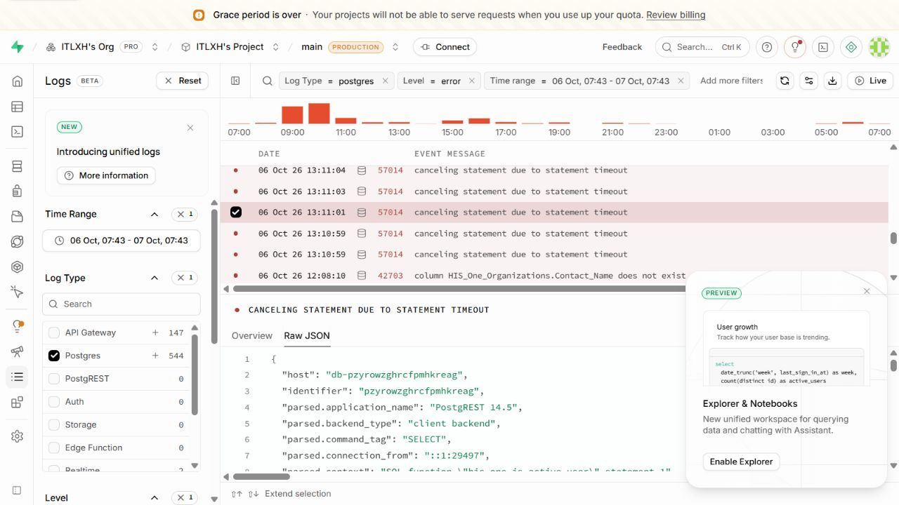
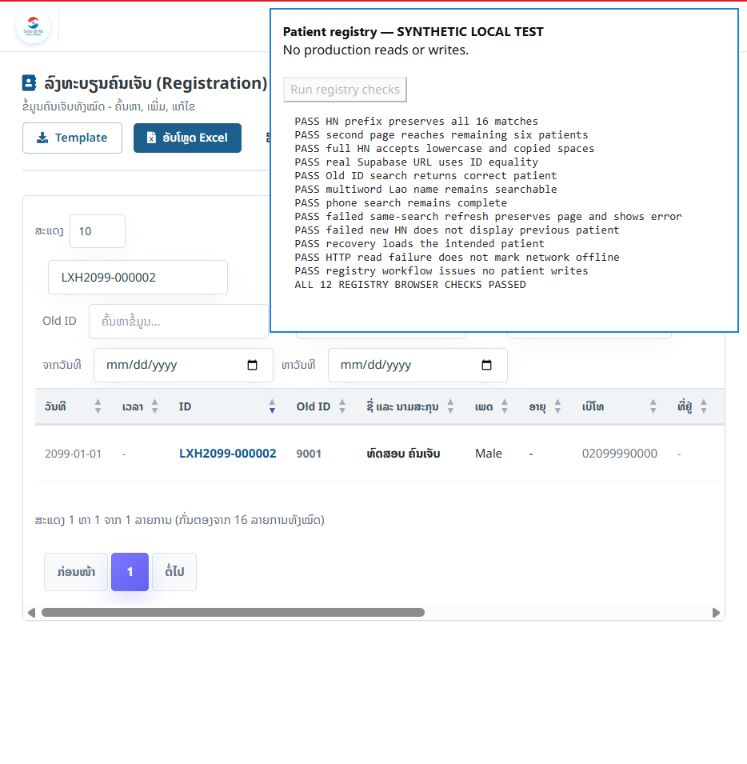

# Live Supabase warning/error audit and patient registry search fix — 2026-10-07

## Scope and production safety

Read the authenticated Supabase unified log dashboard for project `pzyrowzghrcfpmhkreag`, main production branch. The fixed log window was 2026-10-06 07:43:57.310 through 2026-10-07 07:43:57.310, Asia/Bangkok (UTC+7). Dashboard filtering, loading existing logs and inspecting SQL metadata were read-only. No clinical queries were replayed, no production CRUD/load tests were run, and no SQL/migration, permission, billing, deployment or production merge was performed.

Earlier audit notes described unavailable authenticated dashboard access at that earlier time. Authenticated dashboard access became available during this investigation. This report adds live evidence; it does not retroactively certify previous deployments.

Only sanitized counts, table/endpoint names and parameterized query shapes are recorded. Patient identifiers, names, phone numbers, visit IDs, JWTs, signed URLs and raw clinical payloads are excluded. The user's patient screenshots are not copied into the repository.

## PostgreSQL: 544 error events in this fixed window

| Message filter | SQLSTATE | Dashboard count | Attribution and limits |
|---|---|---:|---|
| `Invalid dataset` | `22023` | 318 | The 11:10:16 Oct 6 detail explicitly identifies `public.uxi_save_app_state(text,jsonb,integer)` raising at line 9. UXI source rejects invalid dataset keys there. A prior audit reproduced its deliberate invalid readiness probe. This confirms the sampled RPC's source, but parameters are not in the log: do not classify every failed real save as a harmless probe. |
| Missing `HIS_One_Organizations.Contact_Name` | `42703` | 71 | HIS's former organization preload selects this nonexistent column. A live Gateway HTTP 400 at 07:40:39 Oct 7 had the identical projection. This code path is still active somewhere; it does not prove the production deployment SHA or whether the browser is using an old bundle. The review branch already removed this field before this session. |
| `canceling statement due to statement timeout` | `57014` | 155 | Opened details at Oct 6 13:11:01, Oct 6 19:08:04 and Oct 7 06:17:46 all selected `HIS_One_Patients` through PostgREST. The projection/order/count match HIS `initPatientTable()`. The 13:11 sample was unfiltered, the 19:08 sample searched seven columns, and the 06:17 sample combined two seven-column token groups. All used an exact count CTE as well as the page query. Ownership of these samples is established; every one of the 155 query bodies has not been inspected. |

These three disjoint message counts sum to 544. The earlier screenshot's 547 was a different rolling window, so do not equate the totals. PostgreSQL and Gateway can record the same failed request at separate layers; their counts must not be added as unique user actions. No inspected timeout sample points to LIS.

The concrete patient problem is a cancelled read, not evidence that the patient row was deleted. The prior error handler returned an empty DataTables page on any read error, causing existing data to disappear. The user's `LXH2020` screenshot shows 16 matches on that successful request; that screenshot alone cannot prove full-HN searches or intermittent timeouts are resolved.

Log-only evidence identifies the timed-out query but cannot distinguish its underlying cost between exact counting, filter/index choices, RLS function evaluation, concurrent load or blocking. Local migrations call active-user/admin functions in RLS policies directly; this is a performance-review candidate, not proof of the currently deployed policies or the cause of these timeouts. Follow [Supabase query performance guidance](https://supabase.com/docs/guides/troubleshooting/canceling-statement-due-to-statement-timeout-581wFv) and [RLS performance guidance](https://supabase.com/docs/guides/troubleshooting/rls-performance-and-best-practices-Z5Jjwv) when profiling a safe staging copy. Do not disable RLS or raise timeouts as a substitute for identifying the cost.

## Other observed warning/error endpoints

Gateway showed 871 warning/error rows for the same fixed window (147 errors, 724 warnings). In the 197 rows loaded during inspection, endpoint groups were: 29 Organizations HTTP 400, 44 staff-avatar HTTP 400, 93 OPD-vitals HTTP 404, 26 Patients HTTP 500, 3 Users HTTP 401 and 2 logout HTTP 403. These are sampled loaded-row counts, not full-window totals for each endpoint.

- `/rest/v1/HIS_One_Patients` HTTP 500 is consistent with the Postgres timeout samples and explains intermittent failed patient searches. Do not mark the whole application offline merely because this endpoint returns an HTTP error.
- `/rest/v1/HIS_One_OPD_Vital_Signs` HTTP 404 requests match HIS's vitals reads. Local migration `20260619090000_ipd_clinical_chart.sql` defines the table/indexes, but that is not proof the production schema has them. Inspect the actual response error code and deployed metadata before deciding whether the issue is a missing/exposed table or schema cache. Do not rerun the entire legacy migration blindly: it also contains access policies.
- Staff-avatar errors were **GETs of signed image URLs**, not evidence that `createSignedUrl` itself failed. Storage logs also show these image GET HTTP 400s. The available unified detail did not supply the error reason, so expired/invalid signatures, missing objects and access conditions remain hypotheses. `src/staffSupabase.js` generates six-hour signed URLs on profile load. Verify the response reason and refresh URLs under the current authorized session before changing storage access or clearing paths. Do not make the private bucket public.
- Storage also recorded backup `/object/info/his-backups/blobs/sha256/<object>` HTTP 400s. A metadata existence check can fail before an upload; the status alone does not establish backup failure. Correlate backup run outcomes before changing or deleting backup objects.
- Users HTTP 401 and logout HTTP 403 require session/error-code correlation. The inspected Gateway metadata alone does not establish whether these were expired sessions, invalid credentials or a different cause. Preserve authentication checks.
- The dashboard's “Grace period is over” warning was present. It warns that requests may stop when quota is exhausted; it does not prove the quota is currently exhausted. Read billing/usage separately; no billing change was made.

The latest default last-hour snapshot showed roughly 2.4k Gateway requests. Successful full-registry paging, repeated user/auth/archive reads, and LIS endpoint reads also appeared. Success traffic is separate from failures; multiple clients/tabs can account for repeated reads. A screenshot showing reminders every ten seconds does not by itself establish one client's polling interval. Prior HIS/LIS/UXI audit documents retain the source-level polling findings.

## Patient search change on the existing review branch

`src/main.js` now:

1. Normalizes canonical full `LXHyyyy-nnnnnn` searches and uses equality on new/old identifier fields, including historical identifiers stored without the hyphen. It does not search names/phones/organizations with seven leading-wildcard predicates for a full HN.
2. Uses identifier-only prefix searches for partial LXH codes. Lao multiword name, numeric Old ID, phone and date filtering remain available. All matching records remain reachable with server-side pagination.
3. Cancels a superseded registry request with `AbortController`, and ignores late results from old draws/users/clinical generations. No retry or write is introduced.
4. Reuses the authorized session's known total for unfiltered pagination. Exact filtered counts remain intact, and registry reinitialization/new-user generation invalidates the total. This removes repeated whole-registry counts on unfiltered paging; it does not eliminate the first count or guarantee that broad name searches can never time out.
5. Preserves the last successful page on a failed refresh **only if the search, column filters, dates, sort, offset and page size match**. A failed search for a different patient shows the load error and does not substitute the previous patient's results.

No patient save/delete/triage operation, role policy or database schema is changed. Build/regression tests and real DataTables browser tests use synthetic fixtures only. They verify behavior and isolation; they cannot certify production latency or CRUD under real hospital load.

## Validation and release status

- `test:patient-registry`: actual registry/table functions executed with synthetic data; full HN, prefix pagination, legacy Old HN, hyphenless HN, Lao name, numeric Old ID, phone, dates, cached total, visit counts, superseded request cancellation, stale-session rejection and scoped failure preservation passed.
- All 23 ordinary `test:*` package scripts passed on the final exact staged export, with the unrelated triage/migration working-tree changes excluded. The production build of that staged snapshot also passed.
- Local production build passed. The existing large-bundle warning remains (about 1.21 MB JavaScript, 299 KB gzip), independent of the Supabase error findings. An initial sandbox build could not read the Vite config; the approved local build passed.
- Browser fixture failures were investigated before release: the test had chained a global HN search onto the phone-column API and expected the wrong result; corrected the test call. Login also needed to allow a restored last-view route. No production call was made during these tests.
- All 12 real-browser DataTables assertions passed. Evidence: `PATIENT_REGISTRY_TEST_2026-10-07.txt` and `PATIENT_REGISTRY_TEST_2026-10-07.png`. The mock backend blocks unexpected external API requests; no patient writes were issued. The staged change is ready for commit/push to `codex/reduce-api-requests-20261006` and the existing draft PR #1, with no main merge. Production is unchanged. This is not a claim that every live timeout, schema/Storage error or real patient workflow is resolved.

Unrelated user edits in `scripts/test-triage-clinical-crud.mjs` and the activity-log migrations are excluded from this change. UXI and LIS sibling checkouts were only read; their releases are controlled separately.

## Published review result

Implementation commit `822d5f63ce2a2dd6750adfd655e34a329df9f286` was successfully pushed to `origin/codex/reduce-api-requests-20261006`; the remote SHA was verified. [PR #1](https://github.com/ITLXH/HIS-LXH-SYSTEM/pull/1) remains open, draft and unmerged. Its Cloudflare Pages check completed successfully. Remote main remained `9a3b39eed3db3312096ca1310e240b4c1357f1db`.

Public production-version navigation encountered a connection reset; the preview alias metadata request could not resolve its hostname from this host. Consequently the currently served production/preview build metadata was not independently verified. A successful Cloudflare check alone does not certify authenticated clinical behavior. No live patient search was replayed to measure latency. Production release remains pending authenticated UAT and schema/query-cost verification for the remaining issues.

